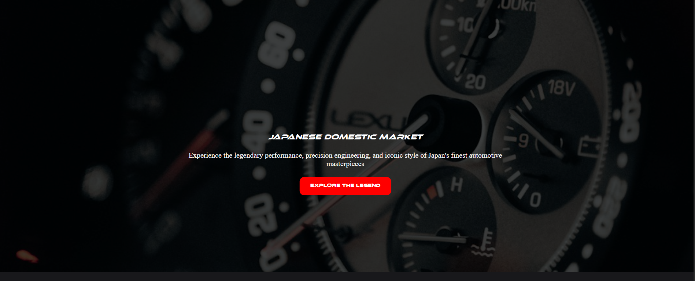
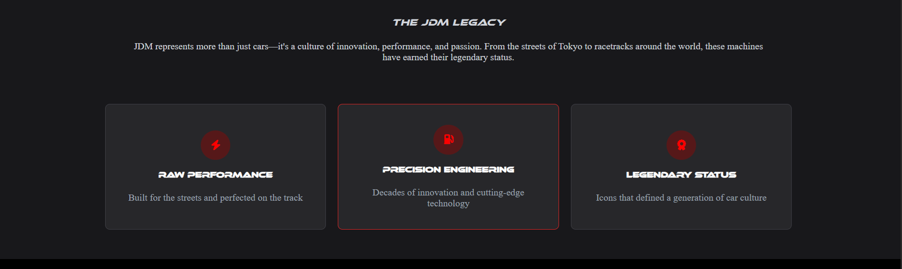
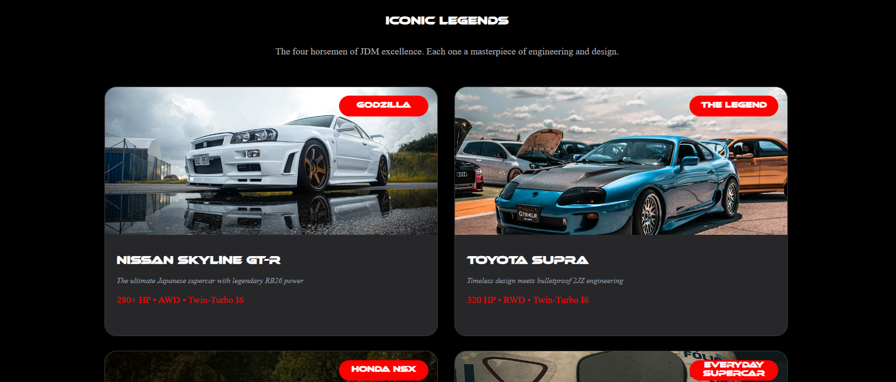
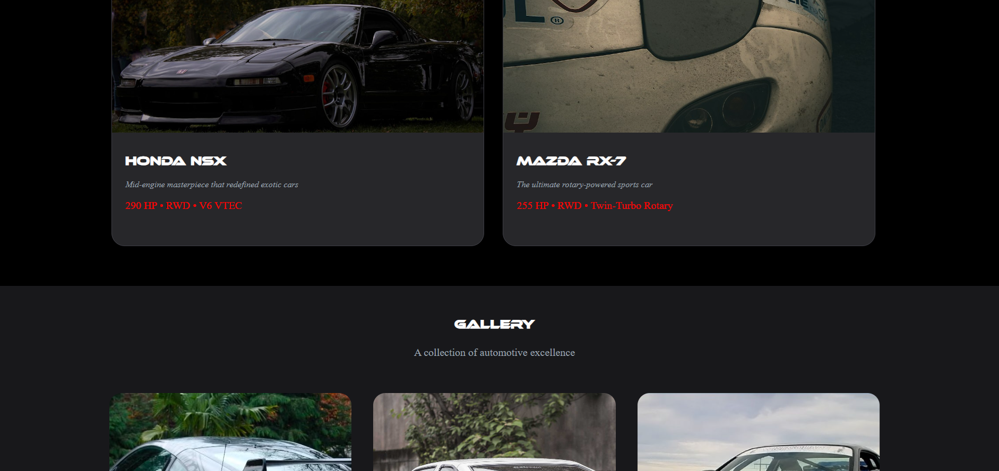
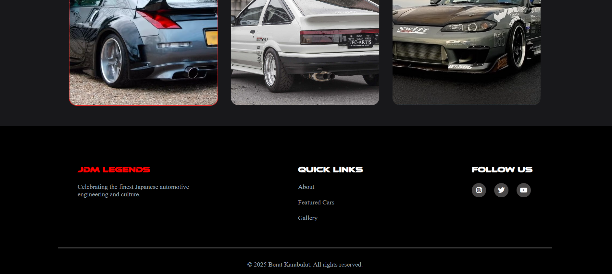

#  **JDM Cars Showcase** 

**Responsive JDM Cars Showcase Website – A Personal Coding Project** ✨

---

## 🚀 **Overview**
I created this JDM Cars showcase website as a fun and educational project. Being a fan of Japanese Domestic Market (JDM) cars, I wanted to design a site that highlights their culture and iconic models.

The project features a clean and responsive design using HTML5 and CSS3, incorporating Flexbox, CSS Grid, and modern layout techniques to create visually engaging sections. The website is fully responsive, ensuring a smooth experience on both desktop and mobile devices.

---

## 🛠️ **Tech Stack**
- **HTML5** 🌐  
- **CSS3** 🎨  

---

## 📑 **Key Highlights**
- 📱 **Fully Responsive:** Optimized for multiple screen sizes, from mobile to desktop.  
- ✨ **Modern Layout:** Clean design leveraging CSS Grid and Flexbox.  
- 🖼️ **Design Details:** Strategic use of `position`, `z-index`, and layout techniques for a polished look.  
- 💻 **Learning Focus:** A practical way to enhance coding skills in HTML, CSS, and responsive design.  

---

## 🎥 **Preview**
  

---

## 🌐 **Live Demo**
The website is hosted on GitHub Pages: [View Live Site](https://beratkrbltt.github.io/jdm-cars/)  

--
